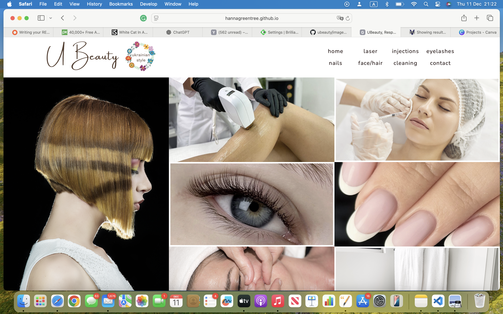
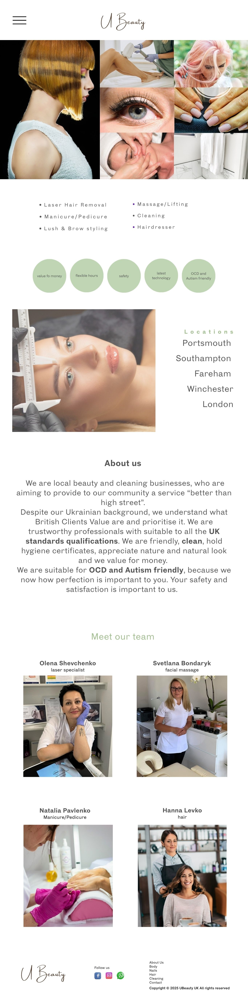

# iBeauty Website

iBeauty is a digital platform connecting Ukrainian beauty and cleaning service professionals with customers in the UK.  
Many of our team members owned beauty salons or worked independently in Ukraine, but due to the war, they had to relocate and rebuild their careers in the UK. Today we have 9 specialists, and we continue to welcome new members to cover more locations and offer a wider range of services.

Ukraine is known as one of the world leaders in beauty services — especially in lashes, brows, and aesthetic treatments.  
We bring that same expertise, professionalism, and dedication to our new customers in the UK.

From a technical perspective, iBeauty is a fully interactive front-end website that puts customers first.  
The site is user-friendly, responsive across all devices, and includes dynamic JavaScript features to enhance the experience.

---

## Project Purpose

iBeauty provides a streamlined, visually appealing, and user-friendly platform for discovering and accessing beauty and wellness services. Users often struggle to find trustworthy service providers, browse portfolios, and book appointments efficiently.  

**Objectives:**
- Showcase services and specialists with rich visual content (animated images, slideshows)  
- Enable easy navigation between pages and sections, including mobile-friendly designs  
- Offer location-based filtering so users can find services near them quickly  
- Provide an engaging, interactive interface that encourages exploration and repeat visits  

---

## Target Audience

- Beauty and wellness clients seeking information about services, specialists, and locations  
- Potential new clients who want a visually appealing, easy-to-navigate platform  
- Mobile users who require a seamless experience across devices  

---

## User Stories

1. As a user, I want to view the team of specialists with their portfolios, so I can choose the right professional for my needs.  
   

2. As a user, I want to filter services by city, so I can find convenient options near me.  
   

3. As a user, I want an engaging homepage with animations and visual cues, so the website feels modern and interactive.  
   

4. As a mobile user, I want the navigation and content to adapt to my device, so I can access services easily on the go.  
   

5. As a returning user, I want a consistent and intuitive layout, so I can quickly find information I need without confusion.  
   

6. As a user, I want to easily contact specialists through multiple channels (phone, WhatsApp, social media), so I can book services conveniently.  
   

---


## Features

- Responsive main navigation menu with hamburger toggle for mobile  
- Interactive image sliders and collages for specialist portfolios  
- Location filter to display services available in specific cities  
- Responsive footer with quick links and search  
- Direct contact options (social media, phone, WhatsApp)  
- Specialist profiles including services, prices, and areas covered  
- Accessible design with alt text for images and sufficient color contrast  
- Contact form with validation  
- Semantic HTML structure for readability and SEO  
- Dynamic front-end interactions using custom JavaScript  

---
## Development Timeline / Actions Taken

- **Initial Planning** – Project goals, wireframes, and content list  
- **Setup** – Folder structure, HTML skeletons, linking CSS & JS  
- **Design** – CSS layouts, fonts, header/footer, color scheme  
- **Functionality** – JavaScript: hamburger menu, animations, filters, slideshows  
- **Content Integration** – Real service & specialist information, alt text for accessibility  
- **Testing & Validation** – Manual tests, HTML/CSS validation  
- **Deployment** – Pushed to GitHub, enabled GitHub Pages, verified live site  

---

## Folder Structure

ibeauty/
├── index.html
├── contact.html
├── laser.html
├── injections.html
├── eyelashes.html
├── nails.html
├── facehair.html
├── cleaning.html
├── css/
│ ├── styles.css
│ └── responsive.css
├── js/
│ ├── script.js
│ ├── slider.js
│ └── filter.js
├── images/
│ ├── UBlogo.png
│ ├── Team1.jpg
│ ├── Laser.jpg
│ ├── user-stories/
│ │ ├── user-story-1.png
│ │ ├── user-story-2.png
│ │ ├── user-story-3.png
│ │ ├── user-story-4.png
│ │ ├── user-story-5.png
│ │ └── user-story-6.png
│ └── ...
└── README.md


---

## Subpages
- ubeauty-fareham.html → Services and specialists in Fareham  
- ubeauty-london.html → Services and specialists in London  
- ubeauty-portsmouth.html → Services and specialists in Portsmouth  
- ubeauty-southampton.html → Services and specialists in Southampton  
- ubeauty-whiteley.html → Services and specialists in Whiteley  
- ubeauty-gosport.html → Services and specialists in Gosport  
- ubeauty-winchester.html → Services and specialists in Winchester  

---

## Navigation
Each page has a **main navigation menu** allowing users to jump to:  

- Home  
- Specific services  
- Location pages  
- Contact  

Includes a **hamburger toggle** for mobile devices.  

---

## Technologies Used

- HTML5 with semantic markup  
- CSS3 (Flexbox, Grid, Media Queries)  
- JavaScript ES6 (sliders, filters, menu toggle)  
- Google Fonts: Nunito Sans, Dancing Script  
- External icons from Google Fonts & free icon packs  
- Responsive layout for all devices  
- Accessible design with alt text and contrast considerations  

---

## Design & Accessibility

- Semantic headers (H1-H4) organize content by priority  
- High contrast between foreground and background for readability  
- Alternative text for images to support screen readers  
- Consistent graphic style and color palette  
- Interactive elements respond to user actions  

---

## Wireframes

### Desktop Wireframes
- [Home page](https://www.canva.com/design/DAGtnpmxvHY/pfgtaUJWTmaK2Vor23m0BA/edit)  
- [Laser Hair & Tattoo removal page](https://www.canva.com/design/DAGtvapvLU4/mmdGn-2LDFqRlDbc6Ug9UA/edit)  
- [Manicure & Pedicure page](https://www.canva.com/design/DAGulmIyh18/gStacu1pzNjJzMIPrjygyw/edit)  
- [Face page](https://www.canva.com/design/DAGtxpJm4Ic/B6-8KNNaQmp_W9LPnRxRCg/edit)  

### Mobile Wireframes
  

---

## Development Timeline / Actions Taken

- **Initial Planning** – Project goals, wireframes, and content list  
- **Setup** – Folder structure, HTML skeletons, linking CSS & JS  
- **Design** – CSS layouts, fonts, header/footer, color scheme  
- **Functionality** – JavaScript: hamburger menu, animations, filters, slideshows  
- **Content Integration** – Real service & specialist information, alt text for accessibility  
- **Testing & Validation** – Manual tests, HTML/CSS validation  
- **Deployment** – Pushed to GitHub, enabled GitHub Pages, verified live site
- 
---

## HTML, CSS & JS Validation

### HTML Validator
✅ All pages passed W3C validation  
https://validator.w3.org/nu/

### CSS Validator
✅ All CSS passed W3C validation  
https://jigsaw.w3.org/css-validator/

### JavaScript Validator
✅ Custom JS passes ESLint/syntax checks  
https://eslint.org/demo  

---

## Deployment

**Live Website:** [iBeauty Live Site](https://hannagreentree.github.io/ibeauty/)  

**Deployment Steps:
Clone the repository:  
```bash
git clone https://github.com/HannaGreentree/iBeauty.git

---

## Deployment & Usage

1. Open the project folder in VS Code  
2. Open **index.html** in a browser or push to GitHub  
3. Enable GitHub Pages in repository settings to host the site  

---

## Version Control

- Managed with **Git & GitHub**  
- Descriptive commit messages document the development process  
- Branches used for feature updates and bug fixes  
- External libraries and code snippets are clearly attributed  

---

## Testing

Manual testing was completed and is documented in [TESTING.md](https://github.com/HannaGreentree/iBeauty/blob/main/TESTING.md)  

---

## Credits & Attribution

- **Hamburger menu:** W3Schools Mobile Navbar  
- **Fonts:** Google Fonts – Nunito Sans, Dancing Script  
- **Icons:** Google Material Symbols / Google Fonts  
- **Images:** Adobe Stock, Pixabay, Pexels, Unsplash  
- **JavaScript snippets:** CodePen / MDN  
- All other code written by **Hanna Greentree**  

---

## Project Rationale

The **U Beauty / iBeauty** project was developed to provide users with a **streamlined, visually appealing, and user-friendly platform** for discovering and accessing beauty and wellness services. In today’s fast-paced world, users often struggle to find trustworthy service providers, browse portfolios, and book appointments efficiently. This project addresses these challenges by offering an **intuitive website experience** that highlights services, specialists, and locations in a clear, engaging manner.

**Purpose:**  
- Showcase services and specialists with rich visual content (animated images, slideshows).  
- Enable easy navigation between pages and sections, including mobile-friendly designs.  
- Offer location-based filtering so users can find services near them quickly.  
- Provide an engaging, interactive interface that encourages exploration and repeat visits.  

**Target Audience:**  
- Beauty and wellness clients seeking information about services, specialists, and locations.  
- Potential new clients who want a visually appealing, easy-to-navigate platform.  
- Mobile users who require a seamless experience across devices.  

**User Stories:**  
- As a user, I want to view the team of specialists with their portfolios, so I can choose the right professional.  
- As a user, I want to filter services by city, so I can find convenient options near me.  
- As a user, I want an engaging homepage with animations and visual cues, so that the website feels modern and interactive.  
- As a mobile user, I want the navigation and content to adapt to my device, so that I can access services easily on the go.  
- As a returning user, I want a consistent and intuitive layout, so I can quickly find information I need without confusion.  

---

## Honest Statement on AI Use

- All code, structure, and design decisions were created by **Hanna Greentree**.  
- AI tools (e.g., ChatGPT) were only used to **clarify syntax, provide guidance, or debug small JS snippets**, not to create the project content or structure.  
 
---


## Author

**Hanna Greentree**  
Project developed as part of Dynamic Front-End Web Development coursework  

---

## Notes

- HTML, CSS, and JS separated for clarity and maintainability  
- CSS passes Jigsaw validator  
- HTML passes W3C validator  
- Semantic markup, accessibility, and responsive layouts applied  
- Consistent file naming, indentation, and comments improve readability

