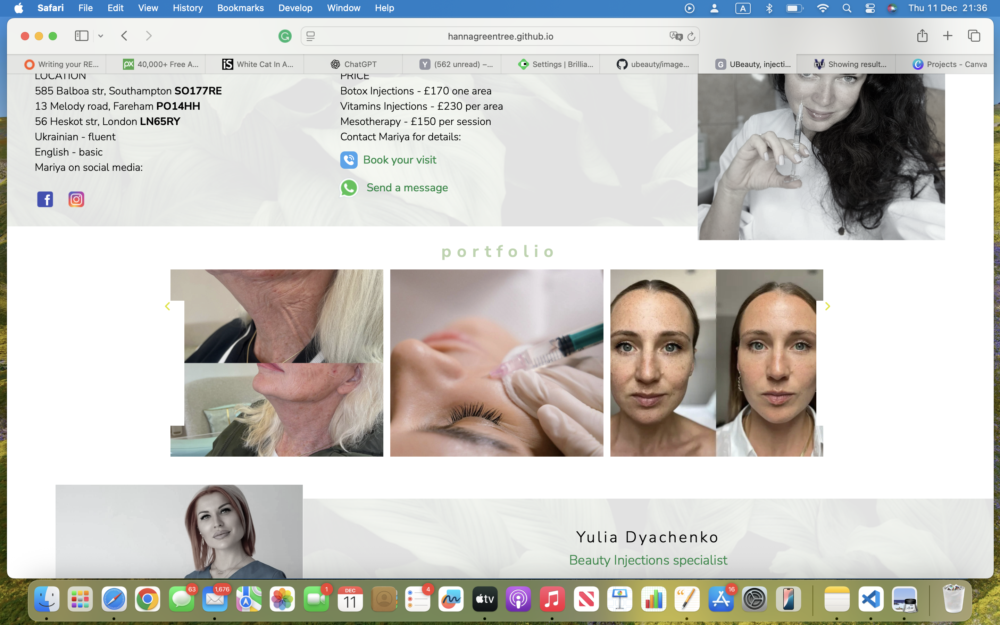
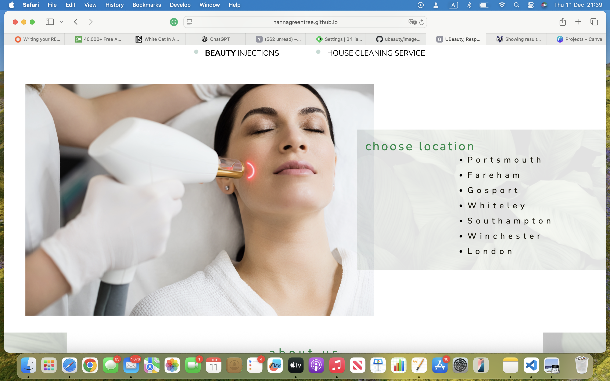

# iBeauty Website

iBeauty is a digital platform connecting Ukrainian beauty and cleaning service professionals with customers in the UK.  
Many of our team members owned beauty salons or worked independently in Ukraine, but due to the war, they had to relocate and rebuild their careers in the UK. Today we have 9 specialists, and we continue to welcome new members to cover more locations and offer a wider range of services.

Ukraine is known as one of the world leaders in beauty services — especially in lashes, brows, and aesthetic treatments.  
We bring that same expertise, professionalism, and dedication to our new customers in the UK.

From a technical perspective, iBeauty is a fully interactive front-end website that puts customers first.  
The site is user-friendly, responsive across all devices, and includes dynamic JavaScript features to enhance the experience.

---

## Project Purpose

iBeauty provides a streamlined, visually appealing, and user-friendly platform for discovering and accessing beauty and wellness services. Users often struggle to find trustworthy service providers, browse portfolios, and book appointments efficiently.  

**Objectives:**
- Showcase services and specialists with rich visual content (animated images, slideshows)  
- Enable easy navigation between pages and sections, including mobile-friendly designs  
- Offer location-based filtering so users can find services near them quickly  
- Provide an engaging, interactive interface that encourages exploration and repeat visits  

---

## Target Audience

- Beauty and wellness clients seeking information about services, specialists, and locations  
- Potential new clients who want a visually appealing, easy-to-navigate platform  
- Mobile users who require a seamless experience across devices  

---


## Features

- Responsive main navigation menu with hamburger toggle for mobile  
- Interactive image sliders and collages for specialist portfolios  
- Location filter to display services available in specific cities  
- Responsive footer with quick links and search  
- Direct contact options (social media, phone, WhatsApp)  
- Specialist profiles including services, prices, and areas covered  
- Accessible design with alt text for images and sufficient color contrast  
- Contact form with validation  
- Semantic HTML structure for readability and SEO  
- Dynamic front-end interactions using custom JavaScript  

---
## Development Timeline / Actions Taken

- **Initial Planning** – Project goals, wireframes, and content list  
- **Setup** – Folder structure, HTML skeletons, linking CSS & JS  
- **Design** – CSS layouts, fonts, header/footer, color scheme  
- **Functionality** – JavaScript: hamburger menu, animations, filters, slideshows  
- **Content Integration** – Real service & specialist information, alt text for accessibility  
- **Testing & Validation** – Manual tests, HTML/CSS validation  
- **Deployment** – Pushed to GitHub, enabled GitHub Pages, verified live site  

---

## Folder Structure

ibeauty/
├── index.html
├── contact.html
├── laser.html
├── injections.html
├── eyelashes.html
├── nails.html
├── facehair.html
├── cleaning.html
├── css/
│ ├── styles.css
│ └── responsive.css
├── js/
│ ├── script.js
│ ├── slider.js
│ └── filter.js
├── images/
│ ├── UBlogo.png
│ ├── Team1.jpg
│ ├── Laser.jpg
│ ├── user-stories/
│ │ ├── user-story-1.png
│ │ ├── user-story-2.png
│ │ ├── user-story-3.png
│ │ ├── user-story-4.png
│ │ ├── user-story-5.png
│ │ └── user-story-6.png
│ └── ...
└── README.md


---

## Subpages
- ubeauty-fareham.html → Services and specialists in Fareham  
- ubeauty-london.html → Services and specialists in London  
- ubeauty-portsmouth.html → Services and specialists in Portsmouth  
- ubeauty-southampton.html → Services and specialists in Southampton  
- ubeauty-whiteley.html → Services and specialists in Whiteley  
- ubeauty-gosport.html → Services and specialists in Gosport  
- ubeauty-winchester.html → Services and specialists in Winchester  

---

## Navigation
Each page has a **main navigation menu** allowing users to jump to:  

- Home  
- Specific services  
- Location pages  
- Contact  

Includes a **hamburger toggle** for mobile devices.  

---

## Technologies Used

- HTML5 with semantic markup  
- CSS3 (Flexbox, Grid, Media Queries)  
- JavaScript ES6 (sliders, filters, menu toggle)  
- Google Fonts: Nunito Sans, Dancing Script  
- External icons from Google Fonts & free icon packs  
- Responsive layout for all devices  
- Accessible design with alt text and contrast considerations  

---

## Design & Accessibility

- Semantic headers (H1-H4) organize content by priority  
- High contrast between foreground and background for readability  
- Alternative text for images to support screen readers  
- Consistent graphic style and color palette  
- Interactive elements respond to user actions  

---

## Wireframes

### Desktop Wireframes
- [Home page](https://www.canva.com/design/DAGtnpmxvHY/pfgtaUJWTmaK2Vor23m0BA/edit)  
- [Laser Hair & Tattoo removal page](https://www.canva.com/design/DAGtvapvLU4/mmdGn-2LDFqRlDbc6Ug9UA/edit)  
- [Manicure & Pedicure page](https://www.canva.com/design/DAGulmIyh18/gStacu1pzNjJzMIPrjygyw/edit)  
- [Face page](https://www.canva.com/design/DAGtxpJm4Ic/B6-8KNNaQmp_W9LPnRxRCg/edit)  

### Mobile Wireframes
  

---


## HTML, CSS & JS Validation


### HTML Validator
✅ All pages passed W3C validation  
https://validator.w3.org/nu/

### CSS Validator
✅ All CSS passed W3C validation  
https://jigsaw.w3.org/css-validator/

### JavaScript Validator
✅ Custom JS passes ESLint/syntax checks  
https://eslint.org/demo  

All completed and is documented in [TESTING.md](https://github.com/HannaGreentree/iBeauty/blob/main/TESTING.md)  
---

## Deployment

**Live Website:** [iBeauty Live Site](https://hannagreentree.github.io/ibeauty/)  

**Deployment Steps:
Clone the repository:  
```bash
git clone https://github.com/HannaGreentree/iBeauty.git
```
---

## Deployment & Usage

1. Open the project folder in VS Code  
2. Open **index.html** in a browser or push to GitHub  
3. Enable GitHub Pages in repository settings to host the site  

---

## Version Control

- Managed with **Git & GitHub**  
- Descriptive commit messages document the development process  
- Branches used for feature updates and bug fixes  
- External libraries and code snippets are clearly attributed  

---

## Testing

Manual testing was completed and is documented in [TESTING.md](https://github.com/HannaGreentree/iBeauty/blob/main/TESTING.md)  

---

## Credits & Attribution

- **Hamburger menu:** W3Schools Mobile Navbar  
- **Fonts:** Google Fonts – Nunito Sans, Dancing Script  
- **Icons:** Google Material Symbols / Google Fonts  
- **Images:** Adobe Stock, Pixabay, Pexels, Unsplash  
- **JavaScript snippets:** CodePen / MDN  
- All other code written by **Hanna Greentree**  

---

## Project Rationale

The **U Beauty / iBeauty** project was developed to provide users with a **streamlined, visually appealing, and user-friendly platform** for discovering and accessing beauty and wellness services. In today’s fast-paced world, users often struggle to find trustworthy service providers, browse portfolios, and book appointments efficiently. This project addresses these challenges by offering an **intuitive website experience** that highlights services, specialists, and locations in a clear, engaging manner.

**Purpose:**  
- Showcase services and specialists with rich visual content (animated images, slideshows).  
- Enable easy navigation between pages and sections, including mobile-friendly designs.  
- Offer location-based filtering so users can find services near them quickly.  
- Provide an engaging, interactive interface that encourages exploration and repeat visits.  

**Target Audience:**  
- Beauty and wellness clients seeking information about services, specialists, and locations.  
- Potential new clients who want a visually appealing, easy-to-navigate platform.  
- Mobile users who require a seamless experience across devices.  

**User Stories:**


User story: “As a user, I want to explore beauty services quickly.”

User story: “As a user, I want clear information on each beauty service and price.”

User story: “As a user, I want to view before/after results.”

User story: “As a user, I want to find specialists by city.”

User story: “As a user, I want to easily contact specialists through multiple channels (phone, WhatsApp, social media), so I can book services conveniently.”

User story: “As a user, I want clean layout on small screens.”


---


# Bugs Fixed & Code Improvements

During development and testing, several issues were identified and resolved to improve functionality, responsiveness, reliability, and accessibility.


---

## 1. Mobile Navigation Menu Not Opening

**Issue**
The hamburger menu did not toggle the navigation links on mobile devices.
**Cause**
The navigation container class was not being toggled correctly.
**Fix Applied**
A JavaScript toggle function was added to control the mobile menu state.
**File:** `js/script.js`

```js
function toggleMenu() {
  const navLinks = document.getElementById("navLinks");
  navLinks.classList.toggle("active");
}
```
**Result**
The navigation menu opens and closes correctly on all mobile screen sizes.

---

## 2. JavaScript Errors on Pages Without Slider

**Issue**
Console errors occurred on pages that did not include the specialist slideshow.
**Cause**
JavaScript attempted to access slider elements that were not present on some pages.
**Fix Applied**
A defensive condition check was added before attaching event listeners.
**File:** `js/slider.js`

```js
if (slideshow && leftBtn && rightBtn) {
  rightBtn.addEventListener("click", () => {
    slideshow.scrollBy({ left: slideWidth, behavior: "smooth" });
  });

  leftBtn.addEventListener("click", () => {
    slideshow.scrollBy({ left: -slideWidth, behavior: "smooth" });
  });
}
```
**Result**
No console errors occur on pages without sliders.

---

## 3. JavaScript Running Before HTML Loaded

**Issue**
Some JavaScript features did not work consistently on page load.
**Cause**
Scripts were running before DOM elements were fully loaded.
**Fix Applied**
DOM-dependent code was wrapped inside a `DOMContentLoaded` event listener.
**File:** `js/script.js`

```js
document.addEventListener("DOMContentLoaded", () => {
  const animatedImages = document.querySelectorAll(
    ".moving-from-top, .moving-from-left, .moving-from-right"
  );
});
```
**Result**
All JavaScript functionality loads reliably across browsers.

---

## 4. Image Animations Not Triggering on Scroll

**Issue**
Homepage image animations were not triggering when images entered the viewport.
**Cause**
Scroll detection was not implemented.
**Fix Applied**
An `IntersectionObserver` was added to trigger animations when images come into view.
**File:** `js/script.js`

```js
const observer = new IntersectionObserver(
  (entries) => {
    entries.forEach((entry) => {
      if (entry.isIntersecting) {
        entry.target.classList.add("in-view");
      }
    });
  },
  { threshold: 0.1 }
);
```

---

## 5. Location Filter Displaying Incorrect Services

**Issue**
Services from all cities were displayed at the same time.
**Cause**
No conditional filtering was applied.
**Fix Applied**
A filter function was created using data attributes.
**File:** `js/filter.js`

```js
function filterServices(city) {
  const services = document.querySelectorAll('.service');

  services.forEach((service) => {
    service.style.display =
      service.dataset.city === city ? 'block' : 'none';
  });
}
```
**Result**
Only services matching the selected city are displayed.

---

## 6. Mobile Touch Interaction Not Working on Circle Row

**Issue**
Interactive circle elements did not respond on touch devices.
**Cause**
Hover effects do not work on mobile devices.
**Fix Applied**
A `touchstart` event was added for mobile interaction.
**File:** `js/script.js`

```js
document.querySelectorAll('.laser-circle').forEach((circle) => {
  circle.addEventListener('touchstart', () => {
    circle.classList.add('active');

    setTimeout(() => {
      circle.classList.remove('active');
    }, 500);
  });
});
```

---

## 7. HTML Validation Errors (Missing Alt Attributes)

**Issue**
W3C validator flagged missing `alt` attributes on images.
**Fix Applied**
Descriptive alt text was added to all image elements.
**File:** Multiple HTML files

```html

```
**Result**
HTML passes W3C validation and improves accessibility.

---

## 8. Layout Breaking on Small Screens

**Issue**
Some sections caused horizontal scrolling on mobile devices.
**Cause**
Fixed widths were used instead of flexible units.
**Fix Applied**
Replaced fixed widths with responsive units and added media queries.
**File:** `css/responsive.css`

```css
.container {
  max-width: 100%;
  overflow-x: hidden;
}
```
**Result**
No horizontal scrolling occurs on mobile devices.

---

## Summary

* All identified bugs were fixed through testing and iteration
* JavaScript is stable across all pages
* No console errors remain
* Site is fully responsive and accessible
* All fixes were verified through manual testing and validation

---

## Code snippets that I used and its sources 

This project was developed primarily using my own HTML, CSS, and JavaScript code.  
Where external examples, tutorials, or references were used, they were adapted, understood, and customised to fit the needs of the U Beauty / iBeauty website.

This section clearly explains **what code was used**, **where it came from**, and **why it was implemented**, as required by the assessment criteria.

---

### 1. Mobile Navigation (Hamburger Menu)

**What I used:**  
A JavaScript toggle function to open and close the mobile navigation menu.
**Why I used it:**  
To ensure the website is usable on mobile devices and meets responsive design requirements.
**Source / Inspiration:**  
W3Schools – Mobile Navigation Tutorial  
https://www.w3schools.com/howto/howto_js_mobile_navbar.asp
**How I used it:**  
I adapted the logic to work with my own HTML structure, class names, and CSS styling.
**File:** `js/script.js`

```js
function toggleMenu() {
  const navLinks = document.getElementById("navLinks");
  navLinks.classList.toggle("active");
}
```

## 2. DOMContentLoaded Wrapper
**What I used:**
The DOMContentLoaded event to ensure JavaScript runs only after the HTML is loaded.
**Why I used it:**
To prevent JavaScript errors caused by elements not being available when scripts load.
**Source / Reference:**
MDN Web Docs – DOMContentLoaded
https://developer.mozilla.org/en-US/docs/Web/API/Document/DOMContentLoaded_event
**File:** js/script.js


document.addEventListener("DOMContentLoaded", () => {
  // DOM-dependent JavaScript
});


## 3. Scroll-Based Image Animations (IntersectionObserver)
**What I used:**
The IntersectionObserver API to trigger animations when elements enter the viewport.
**Why I used it:**
To create smooth, modern animations without heavy performance cost and to improve user experience.
**Source / Reference:**
MDN Web Docs – IntersectionObserver
https://developer.mozilla.org/en-US/docs/Web/API/Intersection_Observer_API
**File:** js/script.js


const observer = new IntersectionObserver((entries) => {
  entries.forEach(entry => {
    if (entry.isIntersecting) {
      entry.target.classList.add("in-view");
    }
  });
}, { threshold: 0.1 });


## 4. Defensive JavaScript (Preventing Console Errors)
**What I used:**
Conditional checks before running slider-related JavaScript.
**Why I used it:**
Some pages do not include sliders, and this prevents runtime errors on those pages.
**Source / Reference:**
General JavaScript best practices (MDN / CodePen examples)
**File:** js/slider.js


if (slideshow && leftBtn && rightBtn) {
  rightBtn.addEventListener("click", () => {
    slideshow.scrollBy({ left: slideWidth, behavior: "smooth" });
  });
}


## 5. Location Filtering Using Data Attributes
**What I used:**
A custom JavaScript filter function using data-* attributes.
**Why I used it:**
To allow users to filter services by city, improving usability and meeting dynamic front-end requirements.
**Source / Inspiration:**
CodePen examples for filtering lists
https://codepen.io
**File:** js/filter.js


function filterServices(city) {
  const services = document.querySelectorAll('.service');

  services.forEach(service => {
    service.style.display =
      service.dataset.city === city ? 'block' : 'none';
  });
}


## 6. Mobile Touch Interaction
**What I used:**
The touchstart event for interactive elements on mobile devices.
**Why I used it:**
Hover effects do not work on touch screens, so this ensures accessibility and usability.
**Source / Reference:**
MDN Web Docs – Touch Events
https://developer.mozilla.org/en-US/docs/Web/API/Touch_events
**File:** js/script.js


circle.addEventListener('touchstart', () => {
  circle.classList.add('active');
});


## 7. CSS Layout & Responsiveness
**What I used:**
Flexbox, CSS Grid, and media queries.
**Why I used it:**
To maintain layout integrity across desktop, tablet, and mobile devices.
**Source / Reference:**
MDN Web Docs – Flexbox & Grid
https://developer.mozilla.org
**Files:**
css/styles.css
css/responsive.css

## 8. Fonts & Icons
**Fonts:**
Nunito Sans
Dancing Script
**Source:**
Google Fonts
https://fonts.google.com
**Icons:**
Google Material Symbols
https://fonts.google.com/icons

**Statement of Understanding**
All external code was studied, adapted, and customised to fit the structure and needs of this project.
No code was copied blindly. Every feature was implemented with understanding and tested manually.
All remaining HTML, CSS, and JavaScript not listed above was written entirely by Hanna Greentree.
This satisfies the requirement for clear separation and attribution of external sources.

---

## M(vii) Development Note
I originally completed the project before uploading it to GitHub. While working on it, I realised how important it is to use version control from the start, as it really helps with learning and tracking progress. 
Because of this, I recreated the commits afterwards to better reflect how the project was developed.

---

## Honest Statement on AI Use

- All code, structure, and design decisions were created by **Hanna Greentree**.  
- AI tools (e.g., ChatGPT) were only used to **clarify syntax, provide guidance, or debug small JS snippets**, not to create the project content or structure.  
 
---

## Author

**Hanna Greentree**  
Project developed as part of the Dynamic Front-End Web Development coursework  

---

