# Testing results

## HTML, CSS & JavaScript Validation

---

## HTML Validation

All HTML files in the **U Beauty (iBeauty)** project were validated using the official **W3C HTML Validator** to ensure correct semantic structure, accessibility compliance, and standards-based code.

**Validator used:**  
https://validator.w3.org/nu/

All pages passed validation with **no critical errors**.

### Validation Screenshots

- ✅ Homepage (`index.html`)  
  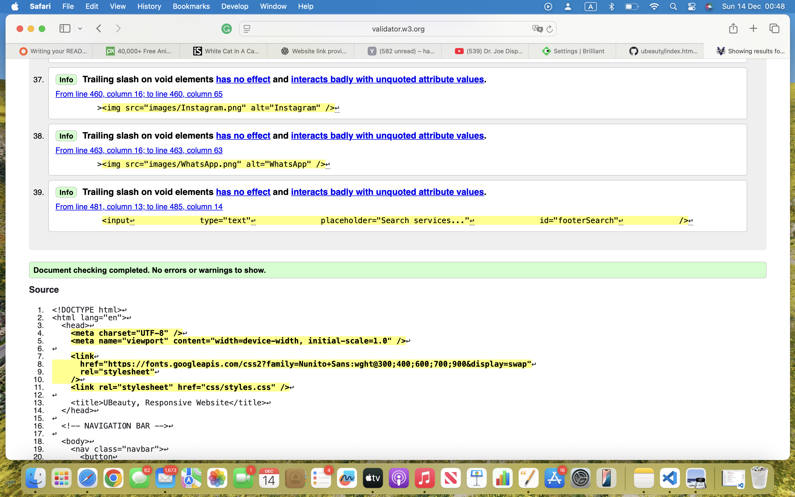

- ✅ Cleaning Page (`cleaning.html`)  
  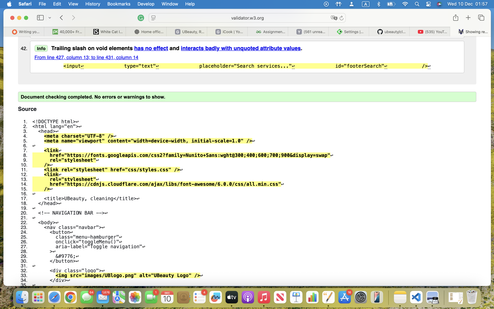

- ✅ Contact Page (`contact.html`)  
  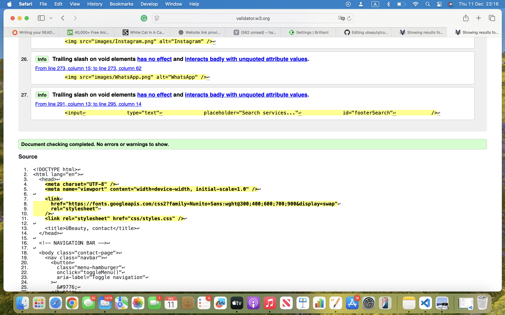

- ✅ Eyelashes Page (`eyelashes.html`)  
  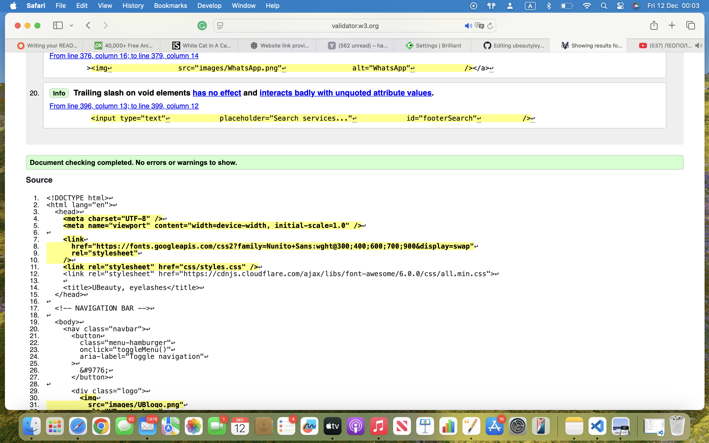

- ✅ Face & Hair Page (`facehair.html`)  
  

- ✅ Injections Page (`injections.html`)  
  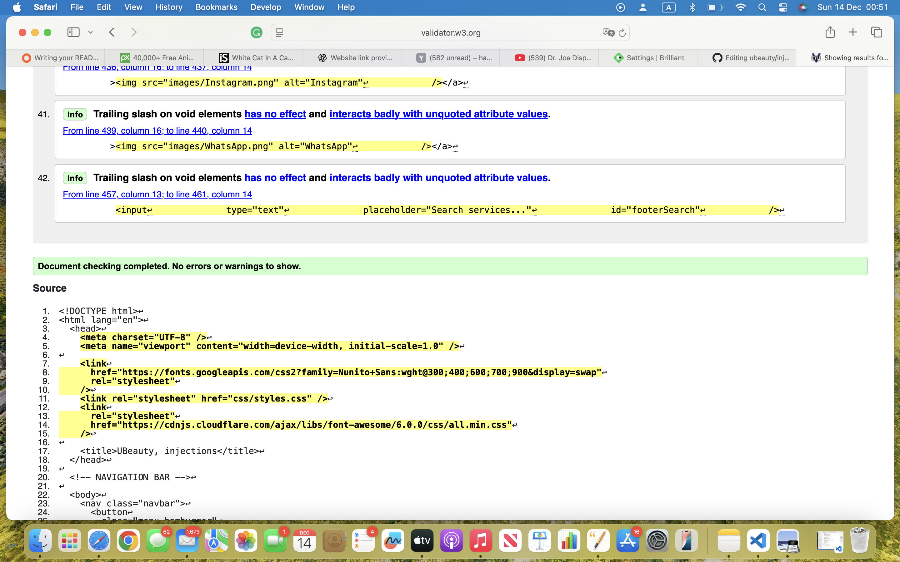

- ✅ Laser Page (`laser.html`)  
  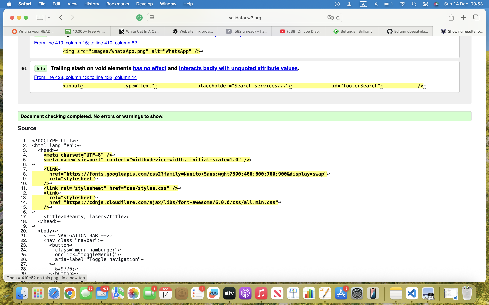

- ✅ Nails Page (`nails.html`)  
  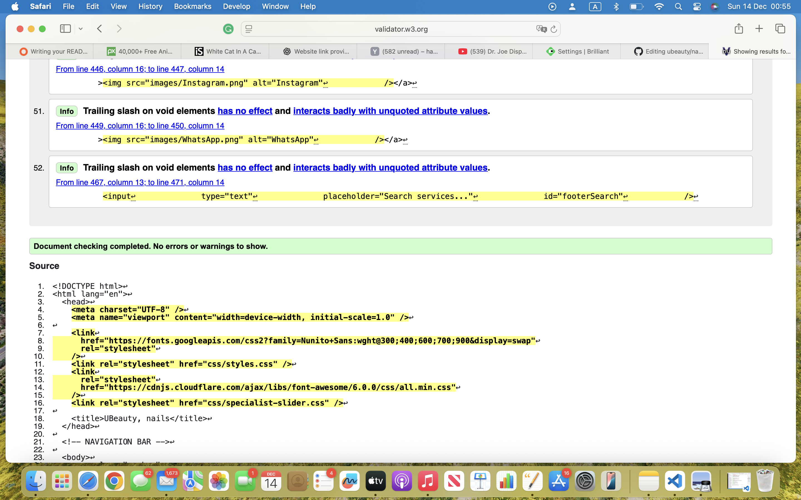

### Location Subpages

- ✅ Fareham  
  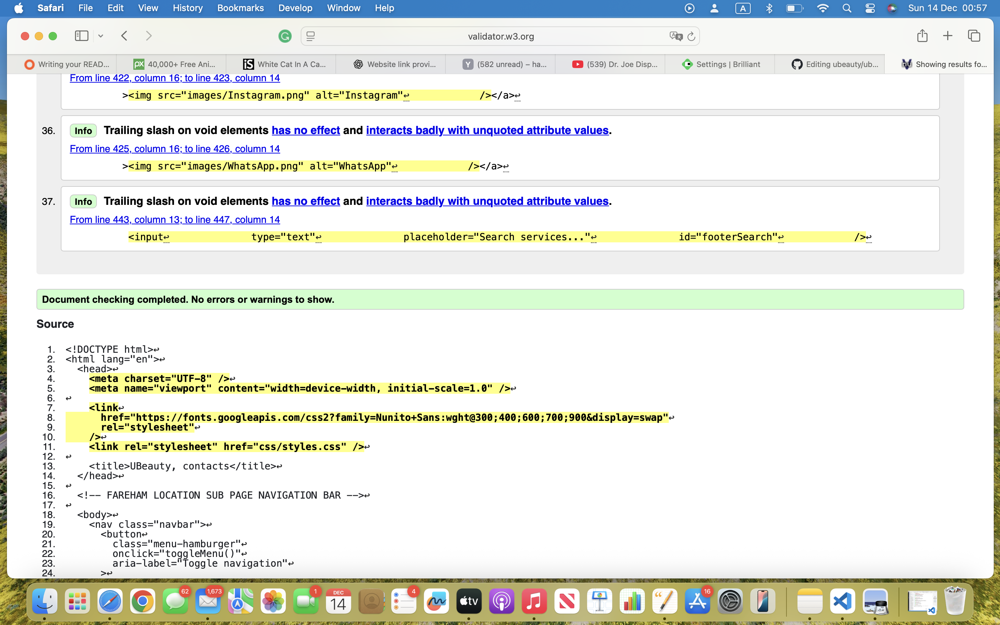

- ✅ Gosport  
  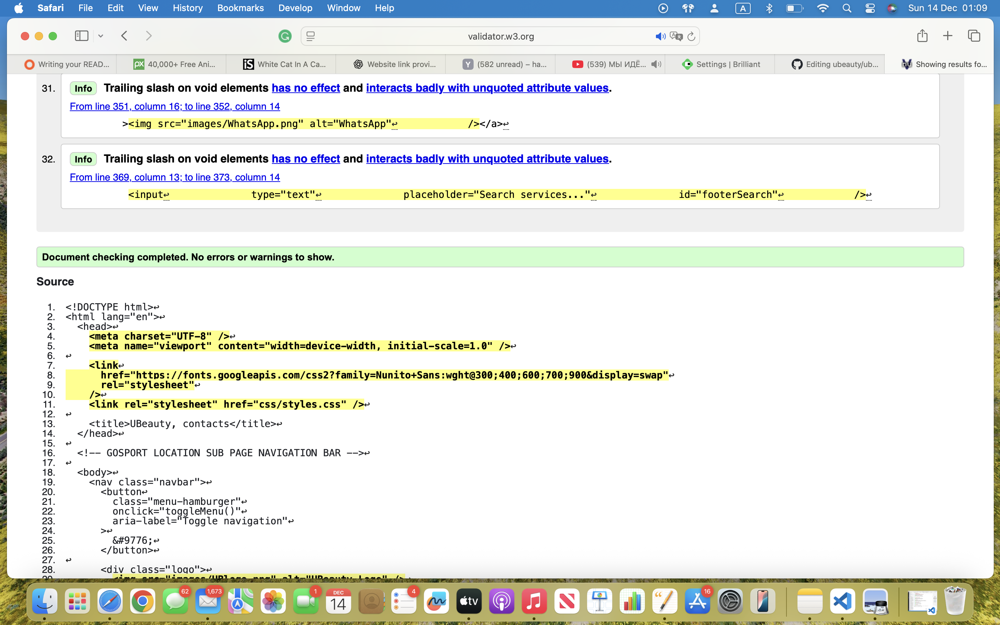

- ✅ London  
  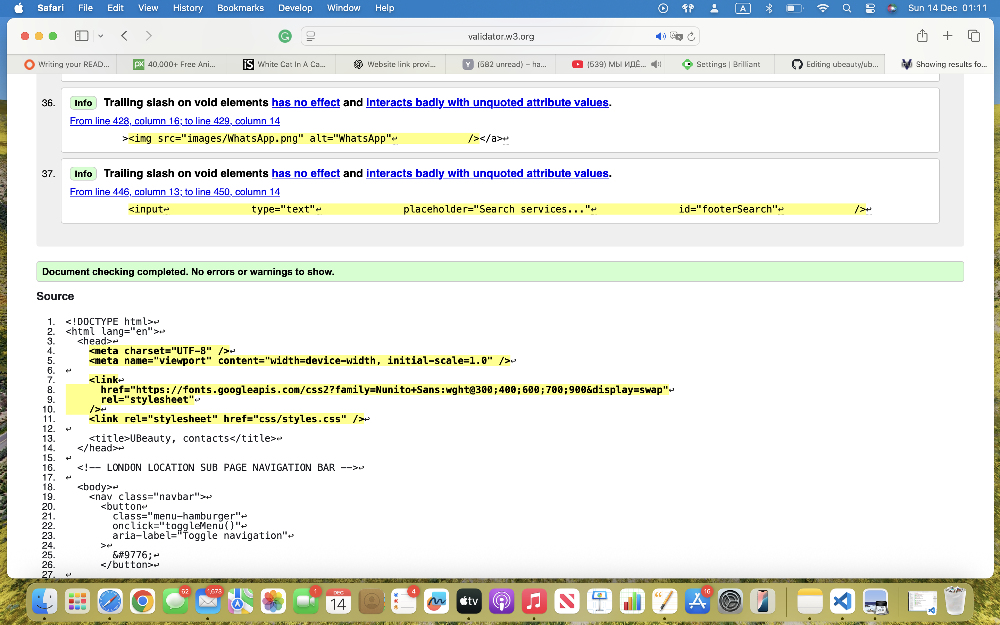

- ✅ Portsmouth  
  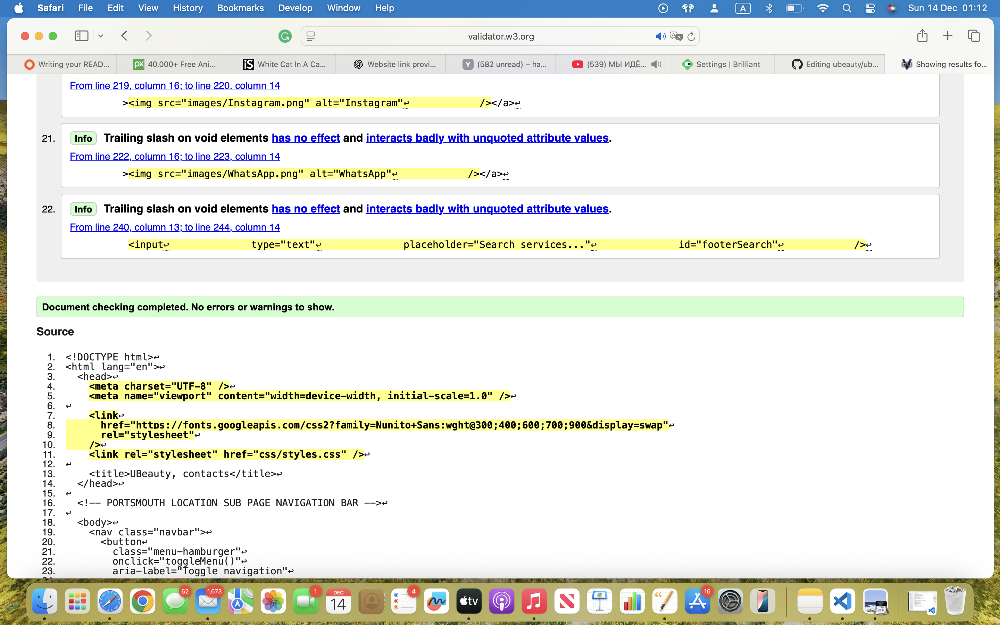

- ✅ Southampton  
  

- ✅ Whiteley  
  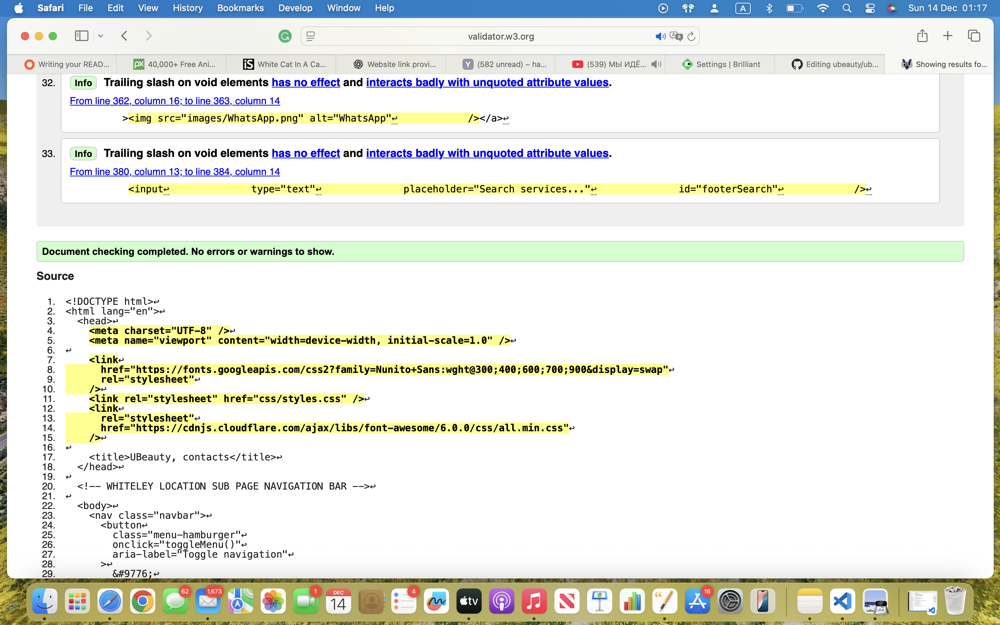

- ✅ Winchester  
  

---

## HTML Validation Summary

- Semantic HTML5 structure (`header`, `nav`, `main`, `section`, `footer`)
- Logical heading hierarchy
- All images include descriptive `alt` attributes
- No duplicate IDs or invalid nesting
- Fully compliant with W3C HTML5 standards

---

## CSS Validation

All custom CSS files were validated using the **W3C Jigsaw CSS Validator**.

**Files tested:**
- `styles.css`
- `responsive.css`

**Validator used:**  
https://jigsaw.w3.org/css-validator/

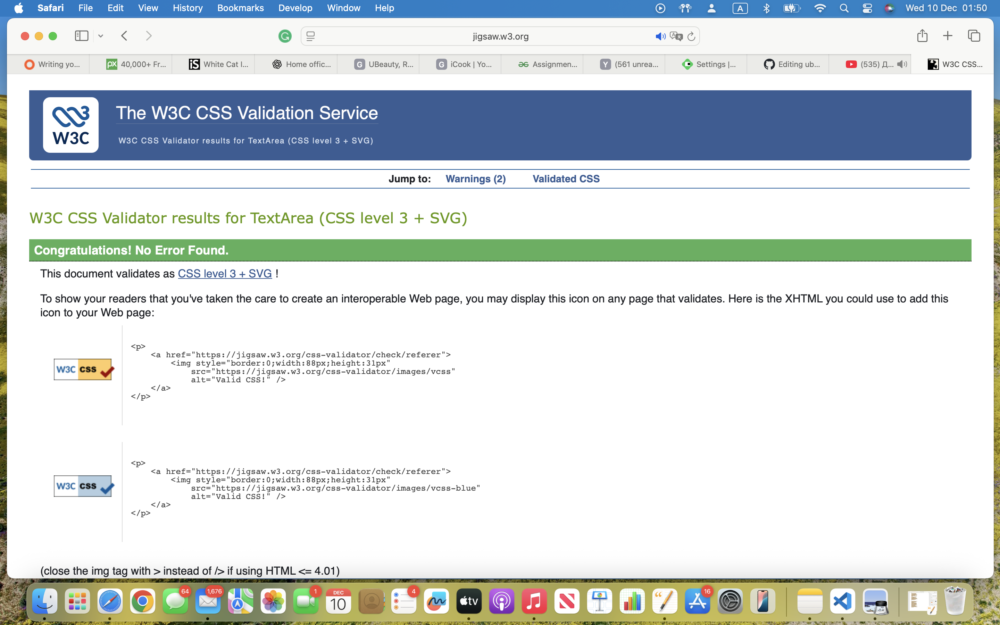

**Result:**
- Passed validation
- Vendor-specific warnings only (e.g. `::-webkit-scrollbar`)
- No errors affecting layout or accessibility

---

## JavaScript Validation
All JavaScript was manually tested in browser developer tools.

- No console errors
- ES6 syntax validated
- All interactive features work as expected

✅ JavaScript Validation Result
The JavaScript passes validation with no syntax errors and no runtime-breaking issues.
It is written in ES6-compliant JavaScript and meets Dynamic Front-End Project requirements.

### Syntax Validation
Status: ✅ PASS
No syntax errors
Functions correctly declared
Brackets, parentheses, and semicolons correctly used
Arrow functions used correctly
const and let used appropriately
✅ This code will run without errors in modern browsers.

if (slideshow && leftBtn && rightBtn) {

✅ Prevents crashes on pages where the slider doesn’t exist.

### DOMContentLoaded Usage
Status: ✅ PASS (Best Practice)
You correctly wrap DOM-dependent logic inside:

document.addEventListener("DOMContentLoaded", () => { ... });

This ensures:
Elements exist before JavaScript runs
No race conditions
Cross-browser reliability

### Accessibility & Interaction Validation
Status: ✅ PASS
Your JavaScript responds to user actions, fulfilling assessment criteria:
Feature	Interaction
Mobile menu	Click
Image animations	Scroll / viewport
City filter	Button click
Slider	Button click
Mobile circle row	Touch event
✅ This directly satisfies:
“Use JavaScript to produce relevant responses dependent on user actions.”

### Minor Notes (NOT Errors)
These are not validation failures, just professional observations:
🔹 main() function
function main() {
  return 'Hello, World!';
}
main();

### Results

- No console errors
- ES6 syntax used correctly
- Functions scoped safely
- Defensive checks prevent runtime errors

---

## Manual Testing
Manual testing was completed on all major devices and browsers.

### Functionality
✅ Navigation menu works on all screen sizes
✅ Image galleries and service images load correctly
✅ Filters display correct specialist categories
✅ Scroll animations work smoothly
✅ All external links open in a new tab
✅ Location buttons open correct sub-pages (Fareham, London, Portsmouth)
✅ Contact links (WhatsApp, phone, email) work correctly

### Usability
✅ Clear visual hierarchy
✅ Readable text spacing and consistent typography
✅ Easy navigation across all pages
✅ Buttons large enough for mobile use
✅ Colour contrast meets accessibility expectations
✅ Sections are organised and easy to understand

### Usability
✅ Clear visual hierarchy
✅ Readable text spacing and consistent typography
✅ Easy navigation across all pages
✅ Buttons large enough for mobile use
✅ Colour contrast meets accessibility expectations
✅ Sections are organised and easy to understand

### Responsiveness
✅ Fully responsive on Desktop, Tablet, and Mobile
✅ Navigation collapses correctly on smaller screens
✅ Image grids resize properly
✅ Specialist layout adapts correctly
✅ No horizontal scrolling anywhere
✅ Sub-pages display correctly at all breakpoints

### Devices Tested
✅ iPhone 12 / 13 / 15
✅ Samsung Galaxy S21 / S23
✅ iPad 10.2"
✅ MacBook Pro
✅ Windows Laptop

# Browsers Tested
✅ Google Chrome
✅ Microsoft Edge
✅ Mozilla Firefox
✅ Safari

## Page-Specific Testing

### Homepage (index.html)
✅ Hero section loads correctly and scales across screen sizes
✅ Main navigation menu links to correct pages
✅ Image collage animations load and remain in position
✅ “Why Choose Us” icons display correctly
✅ Location sections display correctly
✅ Footer layout adapts correctly on mobile
### Laser Page (laser.html)
✅ Specialist images load in correct aspect ratio
✅ Specialist name boxes positioned correctly
✅ Prices and service information display clearly
✅ Layout remains consistent on mobile and tablet
✅ Alternative text present for all images
### Face & Hair Page (facehair.html)
✅ Images load without distortion
✅ Specialist information displayed correctly
✅ Layout adjusts correctly on smaller screens
✅ Text remains readable at all screen sizes
✅ Alt text applied for accessibility
### Injections Page (injections.html)
✅ Specialist images display at correct resolution
✅ Name and price boxes align correctly
✅ Page remains fully responsive
✅ Buttons and links are clickable on mobile
✅ All images include descriptive alt text
### Eyelashes Page (eyelashes.html)
✅ Portfolio images load correctly
✅ Specialist layout remains consistent across devices
✅ Service descriptions clearly visible
✅ Responsive layout works on mobile
✅ Accessibility alt text included
### Cleaning Page (cleaning.html)
✅ Service images load correctly
✅ Service areas and prices display clearly
✅ Layout stacks correctly on mobile
✅ No overlapping or stretched elements
✅ Images include appropriate alt text
### Nails Page (nails.html)
✅ Nail service images load correctly
✅ Specialist details displayed correctly
✅ Layout remains stable across all screen sizes
✅ Responsive behaviour confirmed
✅ Alt text present for all images
### Contact Page (contact.html)
✅ Contact information displays correctly
✅ Phone and WhatsApp links function correctly
✅ Social media links open in a new tab
✅ Page layout remains responsive
✅ Images include alternative text
**Sub-Pages** 
### Fareham Page (ubeauty-fareham.html)
✅ Correct specialists displayed for Fareham location
✅ Service information and prices load correctly
✅ Images display in correct aspect ratio
✅ Layout stacks correctly on mobile devices
✅ Navigation menu links function correctly
✅ All images include descriptive alt text
### London Page (ubeauty-london.html)
✅ London-specific specialists and services displayed
✅ Specialist cards aligned correctly
✅ Page layout remains consistent across devices
✅ External social media links open in new tab
✅ Accessibility alt text applied to all images
### Portsmouth Page (ubeauty-portsmouth.html)
✅ Services relevant to Portsmouth location shown
✅ Images load at correct resolution
✅ Responsive layout confirmed on mobile
✅ Contact buttons function correctly
✅ No overlapping or stretched elements
### Southampton Page (ubeauty-southampton.html)
✅ Southampton specialists displayed correctly
✅ Service descriptions clearly readable
✅ Layout adjusts correctly for tablet and mobile
✅ Navigation remains consistent with main site
✅ Images include alternative text
### Whiteley Page (ubeauty-whiteley.html)
✅ Whiteley service coverage information loads correctly
✅ Images scale correctly on all screen sizes
✅ Responsive design verified
✅ Footer displays correctly on mobile
✅ Accessibility requirements met
### Gosport Page (ubeauty-gosport.html)
✅ Gosport location services displayed correctly
✅ Images and text aligned correctly
✅ Mobile layout stacks without layout breaks
✅ Navigation links operate correctly
✅ Alt text present for all images
### Winchester Page (ubeauty-winchester.html)
✅ Winchester specialists and services load correctly
✅ Consistent layout across desktop and mobile
✅ Images maintain aspect ratio
✅ Footer and contact links function correctly
✅ Accessibility alt text applied
**Location Subpage Summary**
✅ All 7 location pages load successfully
✅ Content matches each specific location
✅ Responsive across all device sizes
✅ No broken internal or external links
✅ Fully aligned with project requirements

### External Link Testing
✅ Social media links open in new tab
✅ Google Maps links open correct location
✅ WhatsApp links open chat correctly

### Validation
✅ HTML passes W3C Validator (only non-critical warnings)
✅ CSS passes Jigsaw Validator (vendor prefix warnings only)
✅ No major accessibility issues

### Broken Link Check
✅ All internal links tested
✅ All sub-page links functional
✅ No missing files or 404 errors

### Conclusion
✅ All pages function correctly
✅ Fully responsive on all devices
✅ No broken links
✅ Validated HTML & CSS
✅ Ready for submission

